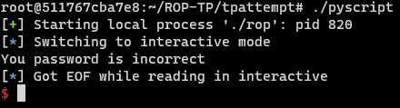

**SÉCURITÉ**  
**BUT Informatique - 3A**

---

*BRODA Lou - DA COSTA CUNHA Bruno - EVARD Lucas - FRANCO Nicolas - SAOULA Zakariya*

# TP ROP

Avant de commencer le TP, assurez vous de bien configurer votre machine à l'aide des étapes suivantes :

**Étape 1** : cloner le repo
```
git clone https://codefirst.iut.uca.fr/git/lucas.evard/ROP-TP.git
```

> Note: pour utilser docker, vous devrez bien évidemment vous mettre sur vdn.

**Étape 2** : construire l'image docker
```
docker build . -t tprop
```

En attendant la fin de la construction de l'image, vous pouvez consulter la documentation sur l'outil `ROP Gadget` qui pourra vous être utile durant le TP :  
- `https://github.com/JonathanSalwan/ROPgadget`  

> ROPGadget est un outil développé par le français Jonathan Salwan. Cet outil vous permet de rechercher vos gadgets sur vos binaires pour faciliter votre exploitation ROP. ROPgadget prend en charge les formats ELF/PE/Mach-O/Raw sur les architectures x86, x64, ARM, ARM64, PowerPC, SPARC, MIPS, RISC-V 64 et RISC-V Compressed.

**Étape 3** : lancer le container 
```
docker run -it tprop
```

**Étape 4** : Vérifiez que vous possèdez le dossier src avec deux fichiers : `vulnerable.c` et `pyscript`

## Exercice (Prise en main de ROPgadget) :

### Compilation d'un programme vulnérable

D'abord, vous trouverez un petit programme vulnérable que nous vous fournirons. 

Utilisez `clang` pour compiler celui-ci :
```
clang -o rop vulnerable.c -m64 -fno-stack-protector  -Wl,-z,relro,-z,now,-z,noexecstack -static
```

_Explication :_
> * clang : Le compilateur Clang est utilisé pour compiler le code source.
> * -o rop : Spécifie le nom du fichier de sortie, "rop" dans ce cas.
> * vulnerable.c : Le fichier source C à compiler, "vulnerable.c" ici.
> * -m64 : Indique que l'on souhaite compiler en mode 64 bits.
> * -fno-stack-protector : Désactive la protection du stack, ce qui peut être nécessaire pour les exploits.
> * -Wl,-z,relro,-z,now,-z,noexecstack : Options passées au linker (ld) pour spécifier diverses options de sécurité :
> * -z,relro : Active la relocalisation en lecture seule, renforcant la sécurité des structures de données.
> * -z,now : Demande au linker de résoudre toutes les références symboliques immédiatement, plutôt qu'à la demande, renforçant ainsi la sécurité.
> * -z,noexecstack : Empêche l'exécution de code à partir de la pile.
> * -static : Indique au linker de lier statiquement les bibliothèques, plutôt que dynamiquement. Cela signifie que toutes les bibliothèques seront incluses dans le binaire final.

***1.*** Lorsque vous compilez ce premier programme, quelle fonction est annoncée comme dangereuse et présente la première faille pour effectuer l'attaque ROP ? 

Lorsquee l'on compile ce premier programme, la fonctions gets est annoncé comme dangereuse:
vulnerable.c:(.text+0x26): warning: the `gets' function is dangerous and should not be used.


On remarque donc la présence d'un `buffer overflow`, nous allons désormais passer à ce binaire un gros buffer à l'aide de la commande suivante :  
```
perl -e 'print "A"x500' | ./rop
``` 

***2.*** Quel type d'erreur classique avec `buffer overflow` cherchons nous à renvoyer avec cette manipulation ?

L'erreur classique qu'on cherche a renvoyé avec "buffer overflow" est une erreur de segmentation (segmentation fault).

### Des mécanismes de défense

Nous espérons que vous avez retenu les deux mécanismes de défenses classiques dont nous vous avons parlé : DEP et ASLR. Alors désormais, passons à la pratique et regardons si ceux-ci sont bien actifs !

> DEP est une mesure de sécurité qui vise à empêcher l'exécution de code malveillant dans des régions de la mémoire réservées aux données.

En utilisant la commande qui suit, prouvez que l'exécution du code malveillant est bien empêchée : 
```
readelf -l rop
```

***3.*** Quelle est la preuve que l'exécution du code malveillant est bien empêchée ?

La secion GNU_STACK a seulement les flags W,R et non X, donc n'est pas exécutable.

> ASLR est une technique qui vise à rendre plus difficile 
l'exploitation de vulnérabilités logicielles en modifiant aléatoirement la disposition des composants clés de l'espace d'adressage d'un processus lors de son démarrage.

Vérifiez que l'ASLR est bien activée sur votre machine à l'aide de la commande suivante qui doit vous retourner `2` :  
```
cat /proc/sys/kernel/randomize_va_space
```

### L'outil ROPgadget

Nous allons à présent passer à l'installation de l'outil ROPGadget dont nous avons parlé plus tôt. Pour cela, référez vous au lien de la documentation que nous vous avons transmis plus tôt. 

Pour commencer à manipuler l'outil, nous allons vous demander en vous appuyant sur le répertoire github et surtout le manuel de l'outil accessible avec la prochaine commande de trouver le nombre de gadgets (ensemble d'instructions finissant par RET) de votre programme vulnérable :
```
ROPgadget --help
```

***3.*** Quelle commande utilisez-vous pour trouver le nombre de gadget à partir de l'exécutable généré plus tôt ?

```
ROPgadget --binary rop
```

On trouve un total de 36470 gadgets unique à partir de l'éxécutable généré plutôt.


En utilisant cette simple commande avec `grep`, vous pourrez désormais localiser tous les gadgets dont vous avez besoin ! Vous pourrez ainsi trouver les gadgets vous permettant d'écrire par exemple (EDX, EAX)*¹.

> *¹ : *EDX & EAX sont des registres du processeur. Les processeurs x86, couramment utilisés dans les ordinateurs personnels, disposent de plusieurs registres, dont EDX et EAX. Ces registres sont utilisés pour stocker temporairement des données pendant l'exécution du programme. Dans le contexte de l'attaque ROP, EDX et EAX sont des registres que l'attaquant pourrait utiliser pour manipuler des données ou des adresses mémoire.*

Néanmoins un problème persiste qui est de trouver un endroit ou écrire en mémoire. Nous voudrons écrire `/bin/sh` quelque part et le fichier `.data` semble être l'endroit parfait car il ne bouge pas malgré l'ASLR.

***4.*** Avec les commandes vues précédemment, vous êtes désormais en capacité de trouver la commande vous permettant de trouver l'adresse de `.data` ?

```
readelf -S rop | grep " .data "
```

permet de trouver l'adresse de .data.

## Exercice (Get a Reverse Shell) :

### Dynamique vs Statique

Tout à l'heure nous avons obtenu un exécutable **statique** de notre programme. Maintenant, nous allons construire un exécutable appelé **dynamique** :
```
gcc -c vulnerable.c -o dynamic.c
``` 
***1.*** Quelle est la différence entre les deux fichiers ?


__Explication__: _Dans le fichier statique toutes les libraries qu'il utilise sont compilées dedans, dans un unique fichier. Le dynamique par contre, fait appel aux libraries pendant l'exécution du programme. Cela est important car avec ROP, les ressources dont dispose l'attaquant dependent du contenu du fichier. Le fait d'avoir les libraries, signifie donc, plus de gadgets possibles._

### Gadgtes et ROPChain

Maintenant que nous avons explorer les bases de ROP, essayons d'exploiter le programme C vulnérable afin d'obtenir un reverse shell ! 

Pour cela, nous vous avons fourni le fichier `pyscript.py`. Ce fichier est un template pour constituer la fameuse __chaine de gadgets__.

```
#!/usr/bin/env python3
# execve generated by ROPgadget

from pwn import *

p = b''

r = process('./rop')

# A COMPLETER
# A COMPLETER
# A COMPLETER
# A COMPLETER
# A COMPLETER
# A COMPLETER
# A COMPLETER
# A COMPLETER
# A COMPLETER
# A COMPLETER
# ...

r.sendline(p)
r.interactive()
```

> Voici une explication du contenu du fichier fourni :
> *  La bibliothèque "pwn" est couramment utilisée dans le domaine de l'exploitation de vulnérabilités pour simplifier la création de chaînes ROP (Return-Oriented Programming) et la manipulation de processus. Elle offre des outils et des fonctions qui rendent plus facile la construction d'une ROPchain.

> * La variable p est initialement définie comme une chaîne de caractères vide. Nous allons concatener les gadgets dessus grâce a pwn.

> * Le script créé un processus en exécutant notre exécutable "rop" (le binaire du programme c vulnérable),avec la ligne `r = process('./rop')`. C'est la préparation de l'attaque contre ce programme.

> * Une fois la RopChain concaténer à p, nous allons la fournir au programme via le processus `r`: avec r.sendline(p).

> * Ensuite, nous rentrons en mode interactif avec `r.interactive()`, ce qui nous permettra d'intéragir avec le shell

Vous noterez que le scipt n'est pas complet ! C'est maintenant à vous de jouer ! 

***2.*** A l'aide de l'outil ROPgadget, construisez la ROP Chain permettant d'obtenir un reverse shell.

---

### Exécuter la RopChain

Vous avez généré la ROPChain grâce à `ROPGadget`, et vous remarquez bien que la syntaxe est similaire à celle du fichier que nous vous avons fourni, vous êtes alors sur la bonne voie. 

Pour exécuter la ropchain, vous devez modifier le fichier `pyscript.py` et certains éléments de la ROPChain fournie par `ROPGadget`.

> Ajouter les lignes concaténant les instructions à `p`.

Dans le script que nous vous avons fourni, nous avons choisi d'utiliser `pwntools` plutôt que `pack`. La syntaxe sera donc un peu différente:

* Il vous faudra remplacer pour chaque ligne de concaténation: `pack('<Q', ` par `p64(` .  

> **TIP**: Vous pouvez utiliser les expression régulières `regex` avec vim pour aller plus vite ! 

Une fois ces modifications effectuées, vous n'avez plus qu'à exécuter le programme python et le tour est joué !

Pour confirmer que vous avez réussi l'exercice, comparez votre terminal avec l'image suivante :




## Exercice (Texte à trou récapitulatif) :

Pour récapituler les notions importantes abordées durant ce TP, nous vous demandons de compléter ce texte à trou :  

> L'attaque ROP (..........) est une technique d'exploitation de vulnérabilités logicielles qui vise à contourner les mécanismes de sécurité modernes, tels que l'exécution aléatoire de la pile (..........) et la prévention de l'exécution de données (..........).

> Cette technique repose sur l'utilisation de .........., qui sont des fragments de code déjà présents dans un programme. Ces deniers se terminent par une instruction de .......... et sont utilisés pour construire des séquences d'instructions malveillantes appelées .......... . Les étapes de l'attaque ROP comprennent l'identification des gadgets, la construction d'une chaîne ROP, le déclenchement de l'attaque en exploitant une vulnérabilité, l'exécution du code malveillant à l'aide des gadgets, et enfin l'atteinte de la cible.  
